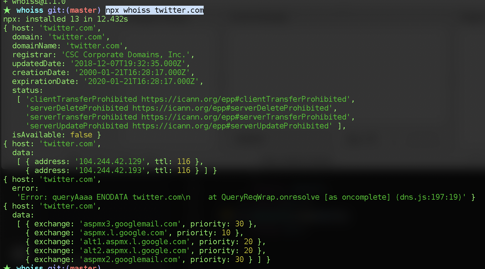

# Whoiss (whois service)

looks up whois and dns info on a host of some sort

```bash
$ whoiss https://www.npmjs.com github.com

# or maybe
$ npx whoiss npmjs.org
```



## TODO
- [ ] do more
- [ ] be better looking
